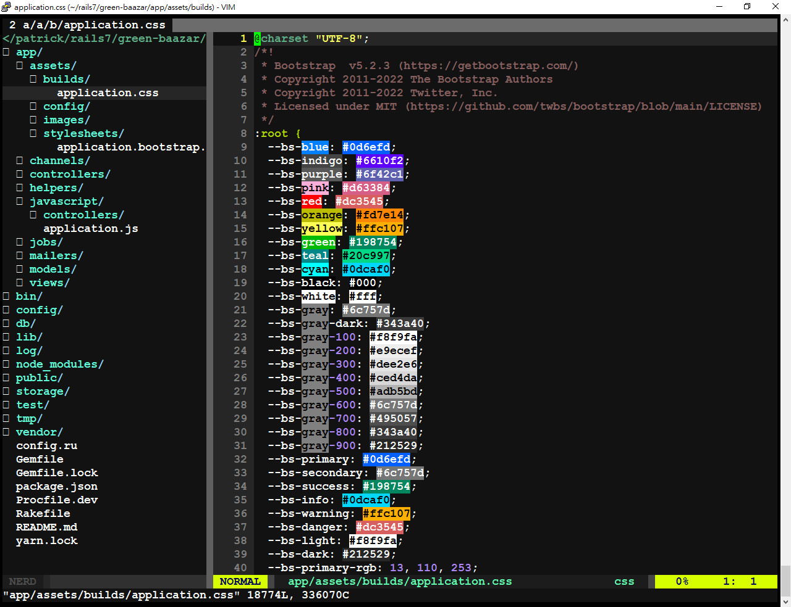
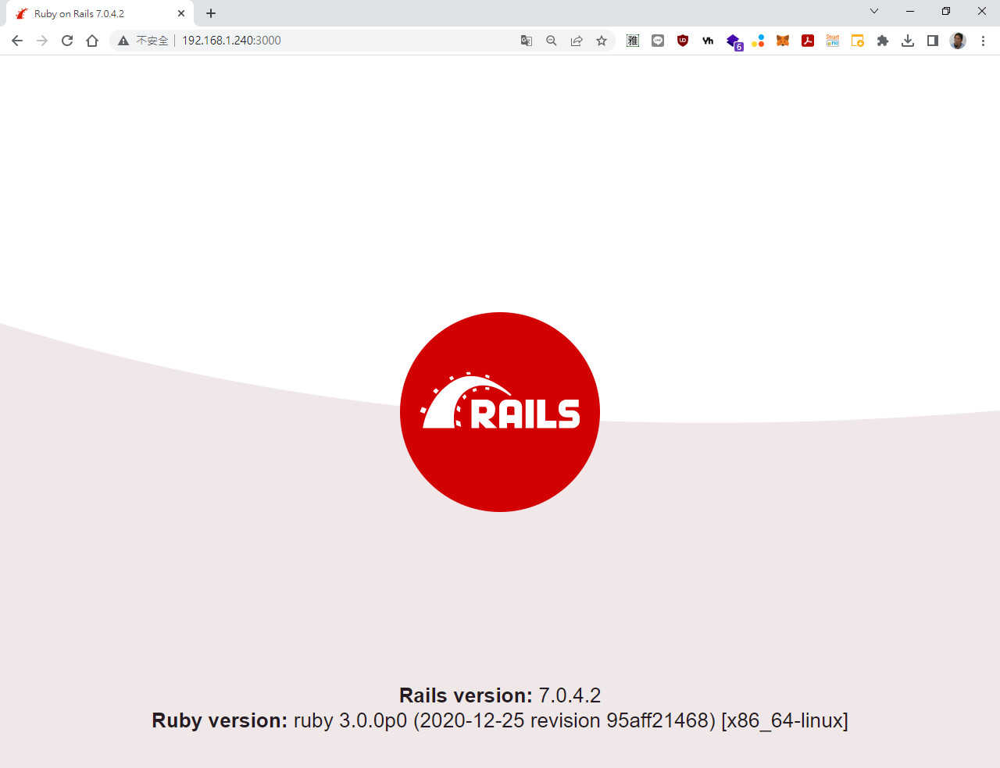
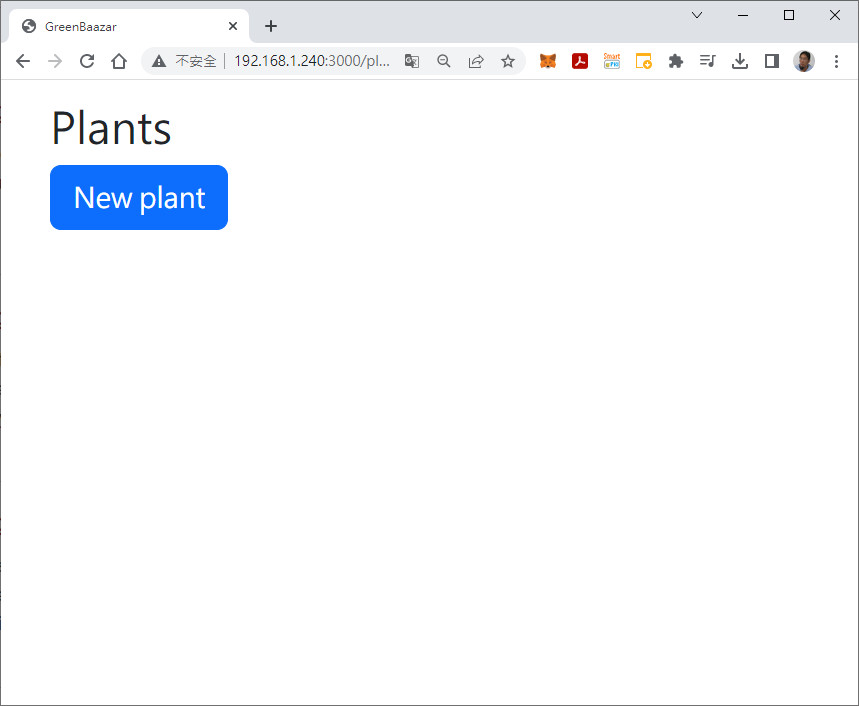
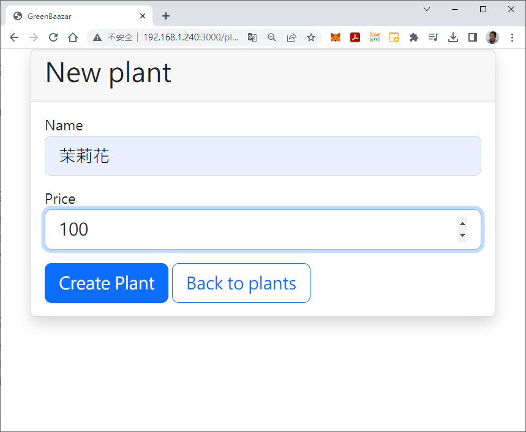
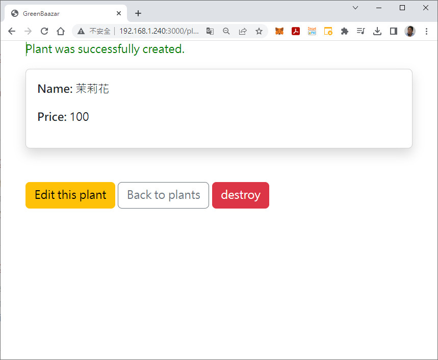
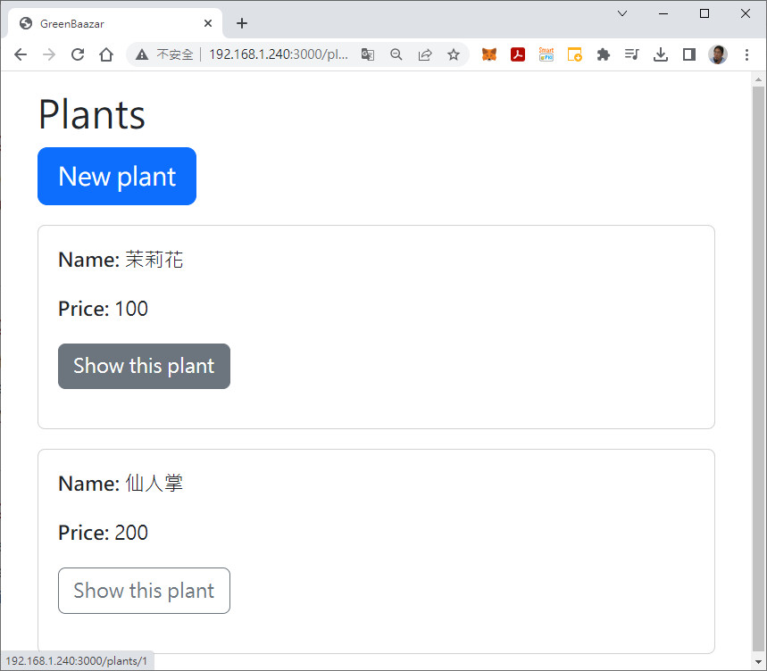
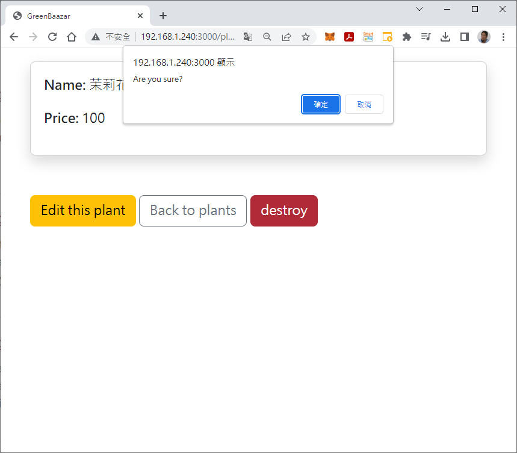
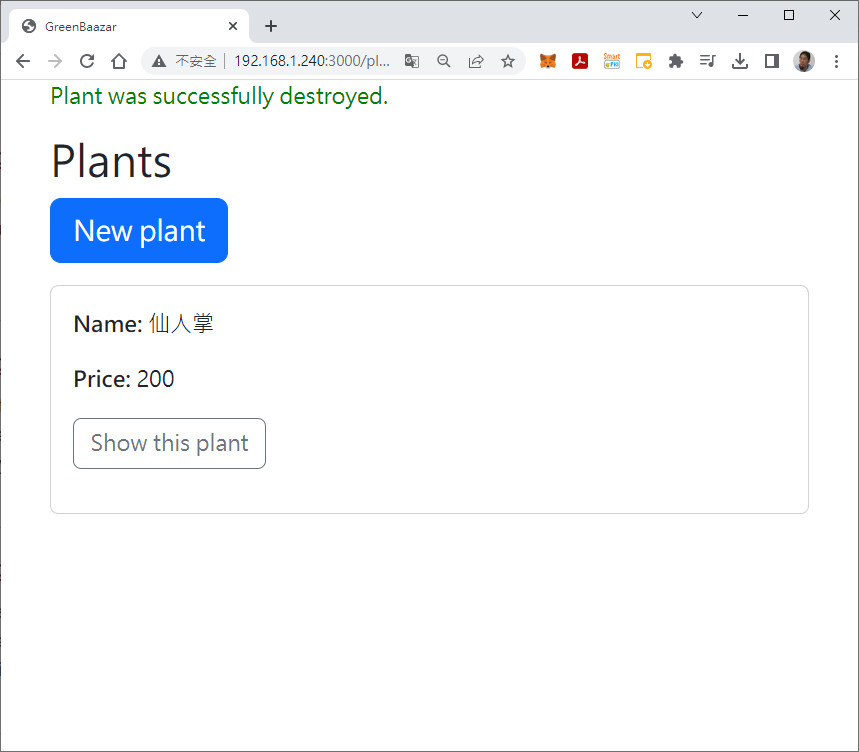

# ●Install Bootstrap 5 with Rails 7

<kbd>蘇介吾 112/03/03</kbd>

[參考自：https://www.youtube.com/watch?v=phOUsR0dm5s](https://www.youtube.com/watch?v=phOUsR0dm5s)

## 一、系統需求

* Ruby 3.0.0p0
* Rails 7.0.4.2
* Node >= 12.x (16.19.1)
* Yarn 1.22.19
* NPM >= 8.3.0 (8.19.3)

## 二、建立新專案

```ruby
$ rails new green-baazar

$ cd green-baazar

$ bundle

$ rails s
  測試 http://localhost:3000

$ vi Gemfile
  加入
  gem 'cssbundling-rails'

$ bundle 

$ rails css:install:bootstrap
  ============================================
  Build into app/assets/builds
      create  app/assets/builds
      create  app/assets/builds/.keep
      append  app/assets/config/manifest.js
Stop linking stylesheets automatically
        gsub  app/assets/config/manifest.js
      append  .gitignore
      append  .gitignore
Remove app/assets/stylesheets/application.css so build output can take over
      remove  app/assets/stylesheets/application.css
Add stylesheet link tag in application layout
File unchanged! The supplied flag value not found!  app/views/layouts/application.html.erb
Add default package.json
      create  package.json
Add default Procfile.dev
      create  Procfile.dev
Ensure foreman is installed
         run  gem install foreman from "."
Fetching foreman-0.87.2.gem
Successfully installed foreman-0.87.2
1 gem installed
Add bin/dev to start foreman
      create  bin/dev
Install Bootstrap with Bootstrap Icons and Popperjs/core
      create  app/assets/stylesheets/application.bootstrap.scss
         run  yarn add sass bootstrap bootstrap-icons @popperjs/core from "."
yarn add v1.22.19
info No lockfile found.
[1/4] Resolving packages...
[2/4] Fetching packages...
[3/4] Linking dependencies...
[4/4] Building fresh packages...
success Saved lockfile.
success Saved 20 new dependencies.
info Direct dependencies
├─ @popperjs/core@2.11.6
├─ bootstrap-icons@1.10.3
├─ bootstrap@5.2.3
└─ sass@1.58.3
info All dependencies
├─ @popperjs/core@2.11.6
├─ anymatch@3.1.3
├─ binary-extensions@2.2.0
├─ bootstrap-icons@1.10.3
├─ bootstrap@5.2.3
├─ braces@3.0.2
├─ chokidar@3.5.3
├─ fill-range@7.0.1
├─ glob-parent@5.1.2
├─ immutable@4.2.4
├─ is-binary-path@2.1.0
├─ is-extglob@2.1.1
├─ is-glob@4.0.3
├─ is-number@7.0.0
├─ normalize-path@3.0.0
├─ picomatch@2.3.1
├─ readdirp@3.6.0
├─ sass@1.58.3
├─ source-map-js@1.0.2
└─ to-regex-range@5.0.1
Done in 4.39s.
      insert  config/initializers/assets.rb
Appending Bootstrap JavaScript import to default entry point
      append  app/javascript/application.js
Add build:css script
         run  npm pkg set scripts.build:css="sass ./app/assets/stylesheets/application.bootstrap.scss:./app/assets/builds/application.css --no-source-map --load-path=node_modules" from "."
         run  yarn build:css from "."
yarn run v1.22.19
$ sass ./app/assets/stylesheets/application.bootstrap.scss:./app/assets/builds/application.css --no-source-map --load-path=node_modules
Done in 2.61s.
  ============================================
  會把 app/stylesheets/application.css 刪除
  重新增加一個名為 app/stylesheets/application.bootstrap.scss
  內容為
  ============================================
  @import 'bootstrap/scss/bootstrap';
  @import 'bootstrap-icons/font/bootstrap-icons';
  ============================================

$ vi app/javascript/application.js 內容為
  ============================================
  import "@hotwired/turbo-rails"
  import "controllers"
  import * as bootstrap from "bootstrap"
  ============================================
  
$ vi app/assets/builds/application.css 內容為
```


```ruby
$ vi package.json 內容為
  ============================================
{
  "name": "app",
  "private": "true",
  "dependencies": {
    "@popperjs/core": "^2.11.6",
    "bootstrap": "^5.2.3",
    "bootstrap-icons": "^1.10.3",
    "sass": "^1.58.3"
  },
  "scripts": {
    "build:css": "sass ./app/assets/stylesheets/application.bootstrap.scss:./app/assets/builds/application.css -- no-source-map --load-path=node_modules"
  }
}
  ============================================

$ rails g scaffold plant name:string price:integer
============================================
      invoke  active_record
      create    db/migrate/20230303072636_create_plants.rb
      create    app/models/plant.rb
      invoke    test_unit
      create      test/models/plant_test.rb
      create      test/fixtures/plants.yml
      invoke  resource_route
       route    resources :plants
      invoke  scaffold_controller
      create    app/controllers/plants_controller.rb
      invoke    erb
      create      app/views/plants
      create      app/views/plants/index.html.erb
      create      app/views/plants/edit.html.erb
      create      app/views/plants/show.html.erb
      create      app/views/plants/new.html.erb
      create      app/views/plants/_form.html.erb
      create      app/views/plants/_plant.html.erb
      invoke    resource_route
      invoke    test_unit
      create      test/controllers/plants_controller_test.rb
      create      test/system/plants_test.rb
      invoke    helper
      create      app/helpers/plants_helper.rb
      invoke      test_unit
      invoke    jbuilder
      create      app/views/plants/index.json.jbuilder
      create      app/views/plants/show.json.jbuilder
      create      app/views/plants/_plant.json.jbuilder  
============================================

$ rails db:migrate

$ vi app/models/plant.rb
  ============================================
   class Plant < ApplicationRecord
     validates :name, :price, presence: true
   end
  ============================================
```

開啟 https://getbootstrap.com/docs/5.1/getting-started/introduction/
備註：Bootstrap 版本為 v5.3


##  三、測試

```ruby
$ rails s -b 0.0.0.0
```

* 打開瀏覽器，輸入 http://ip:3000



## 四、修改

* 修改佈景主題 app/views/layouts/application.html.erb 

  `記得把 javascript_importmap_tags 註解，再新增 javascipt_include_tag "turbo"，不然刪除時不會跳出確認訊息！`

```ruby
$ vi app/views/layouts/application.html.erb
  ============================================
  <!DOCTYPE html>
  <html>
    <head>
      <title>GreenBaazar</title>
      <meta name="viewport" content="width=device-width,initial-scale=1">
      <%= csrf_meta_tags %>
      <%= csp_meta_tag %>

      <%= stylesheet_link_tag "application", "data-turbo-track": "reload" %>
      <%# javascript_importmap_tags %>
      <%= javascript_include_tag "turbo", type: "module" %>
    </head>

    <body>
      <div class="container">
          <div class="row">
             <%= yield %>
          </div>
       </div>
    </body>
  </html>
  ============================================
```

* 修改視圖

```ruby
$ vi app/views/plant/new.html.erb
  ============================================
  <div class="col-lg-8 mx-auto">
      <div class="card shadow">
          <div class="card-header">
              <h1 class="card-title">New plant</h1>
          </div>
          <div class="card-body">
            <%= render "form", plant: @plant %>
          </div>    
      </div>
  </div>
  ============================================

$ vi app/views/plant/edit.html.erb  #幾乎同 new.html.erb，只差在 Title
  ============================================
  <div class="col-lg-8 mx-auto">
      <div class="card shadow">
          <div class="card-header">
              <h1 class="card-title">Edit plant</h1>
          </div>
          <div class="card-body">
            <%= render "form", plant: @plant %>
          </div>    
      </div>
  </div>
  ============================================              
                 
$ vi app/views/plant/_form.html.erb
  ============================================
  <%= form_with(model: plant) do |form| %>
    <% if plant.errors.any? %>
        <div style="color: red">
          <h2><%= pluralize(plant.errors.count, "error") %> prohibited this plant form being saved:</h2>
          <ul>
            <% plant.errors.each do |error| %>
              <li><%= error.full_message %></li>
            <% end %>
          </ul>
      </div>
    <% end %>

    <div class="form-group mb-3">
      <%= form.label :name, style: "display: block" %>
      <%= form.text_field :name, class: "form-control form-control-lg" %>
    </div>
              
    <div class="form-group mb-3">
      <%= form.label :price, style: "display: block" %>
      <%= form.number_field :price, class: "form-control form-control-lg" %>
    </div>
              
    <div class="form-group mt-3">
      <%= form.submit class: "btn btn-lg btn-primary" %>
      <%= link_to "Back to plants", plants_path, class: "btn btn-lg btn-outline-primary" %>
    </div>            
  <% end %>
  ============================================              
  
$ vi app/views/plant/show.html.erb
  ============================================
  <p style="color: green"><%= notice %></p>
  <div class="col-lg-8">
    <div class="card shadow">
      <div class="card-body">
        <%= render @plant %>
      </div>
    </div>
    <div class="mt-5">
      <%= link_to "Edit this plant", edit_plant_path(@plant), class: "btn btn-warning" %>
      <%= link_to "Back to plants", plants_path, class: "btn btn-outline-secondary" %>
      <%= link_to 'destroy', @plant, data: { turbo_method: :delete, turbo_confirm: "Are you sure?"}, class: "btn btn-danger" %>
    </div>
  </div>
  ============================================
            
$ vi app/views/plant/index.html.erb
  ============================================
  <p style="color: green"><%= notice %></p>
  <div class="color-lg-8 mx-auto">
    <h1>Plants</h1>
    <%= link_to "New plant", new_plant_path, class: "btn btn-lg btn-primary mb-3" %>    
    <div id="plants">
      <% @plants.each do |plant| %>
        <div class="card shoadow mb-3">
          <div class="card-body">
            <%= render plant %>
            <p><%= link_to "Show this plant", plant, class: "btn btn--outline-secondary" %></p>
          </div>
        </div>
      <% end %>
    </div>
  </div>
  ============================================
````

## 五、執行













---

= END =
